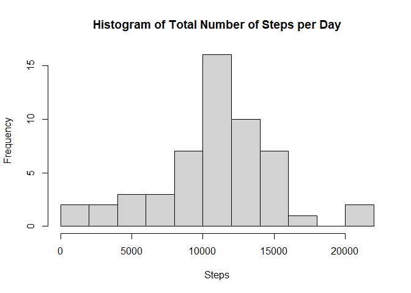
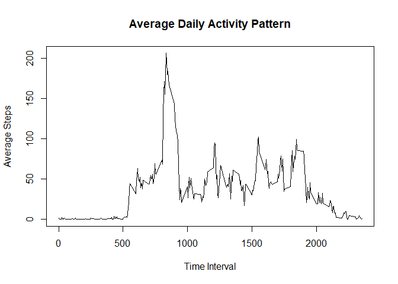
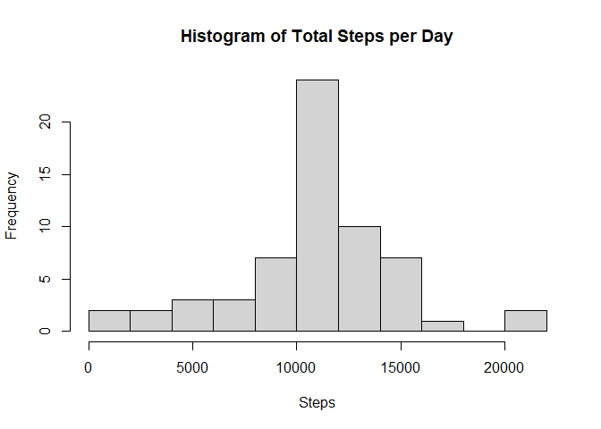
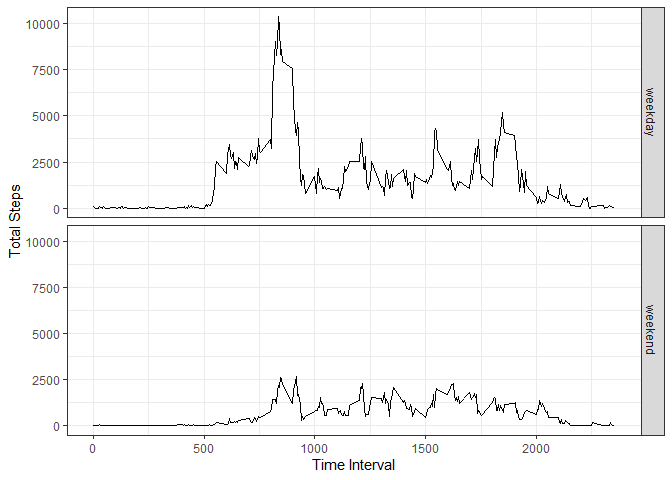

```r
library(dplyr)
library(ggplot2)
```

## Loading and preprocessing the data

```r
if (!dir.exists("tmp")) {
  dir.create("tmp")
}
if (!file.exists(file.path("tmp", "activity.csv"))) {
  unzip("activity.zip", exdir = "tmp")
}
# converting values in the date column to Date objects
data <- as_tibble(read.csv(file.path("tmp", "activity.csv"))) %>%
  mutate(date = as.Date(date))
```

## What is mean total number of steps taken per day?


```r
steps_by_date_0 <- data %>%
  filter(!is.na(steps)) %>%
  group_by(date) %>%
  summarise(total_steps = sum(steps))
```

> Note: ignoring all data rows with missing values.


```r
hist(steps_by_date_0$total_steps,
  breaks = 10,
  main = "Histogram of Total Number of Steps per Day",
  xlab = "Steps")
```

<!-- -->


```r
mean(steps_by_date_0$total_steps)
```

```
## [1] 10766.19
```

```r
median(steps_by_date_0$total_steps)
```

```
## [1] 10765
```

## What is the average daily activity pattern?


```r
average_activity <- data %>%
  filter(!is.na(steps)) %>%
  group_by(interval) %>%
  summarise(mean_steps = mean(steps))
```


```r
with(average_activity,
     plot(interval, mean_steps,
          type = "l",
          ylab = "Average Steps",
          xlab = "Time Interval",
          main = "Average Daily Activity Pattern")
)
```

<!-- -->

The time interval with maximum steps averaged across all days:


```r
with(average_activity,
     interval[which.max(mean_steps)]
)
```

```
## [1] 835
```

## Imputing missing values

The total number of rows with `NAs`:


```r
missing_data <- is.na(data$steps)
sum(missing_data)
```

```
## [1] 2304
```

For imputation of missing values the average of steps for the particular time interval is taken:


```r
# taking the interval from all rows with missing data ...
missing_data_intervals <- data[missing_data, "interval"]
# ... and grabbing the according average steps for those intervals
missing_data_fill_in <-
  average_activity[interval = missing_data_intervals, ]$mean_steps
```


```r
imputed_data <- data.frame(data)
imputed_data[missing_data, "steps"] <- missing_data_fill_in
```


```r
steps_by_date <- imputed_data %>%
  group_by(date) %>%
  summarise(total_steps = sum(steps))
```


```r
hist(steps_by_date$total_steps,
  breaks = 10,
  main = "Histogram of Total Steps per Day",
  xlab = "Steps")
```

<!-- -->


```r
mean(steps_by_date$total_steps)
```

```
## [1] 10766.19
```

```r
median(steps_by_date$total_steps)
```

```
## [1] 10766.19
```

The applied data imputation has an impact on the result of the presented statistics:

- as the number of average steps for the time interval is used,
  there is an increase in the according bin of the histogram
- the overall mean is not affected, as the mean value itself is used for imputation
- the median is *pulled* towards the mean. Moreover, as imputed values are not whole numbers,
  the median is not a whole number anymore.

## Are there differences in activity patterns between weekdays and weekends?


```r
weekday_vs_weekend <- imputed_data %>%
  mutate(day_type = factor(case_when(
    as.POSIXlt(date)$wday == 0 ~ "weekend",
    as.POSIXlt(date)$wday == 6 ~ "weekend",
    TRUE ~ "weekday"))) %>%
  group_by(day_type, interval) %>%
  summarise(total_steps = sum(steps))
```


```r
ggplot(weekday_vs_weekend, aes(x = interval, y = total_steps)) +
  facet_grid(day_type ~ .) +
  geom_line() +
  xlab("Time Interval") + ylab("Total Steps") +
  theme_bw()
```

<!-- -->

On weekdays the number of steps are slightly higher than on the weekend.
Particularly, the activity starts earlier with a peak at about 8-9am,
which differs fundamentally to the weekend pattern.
